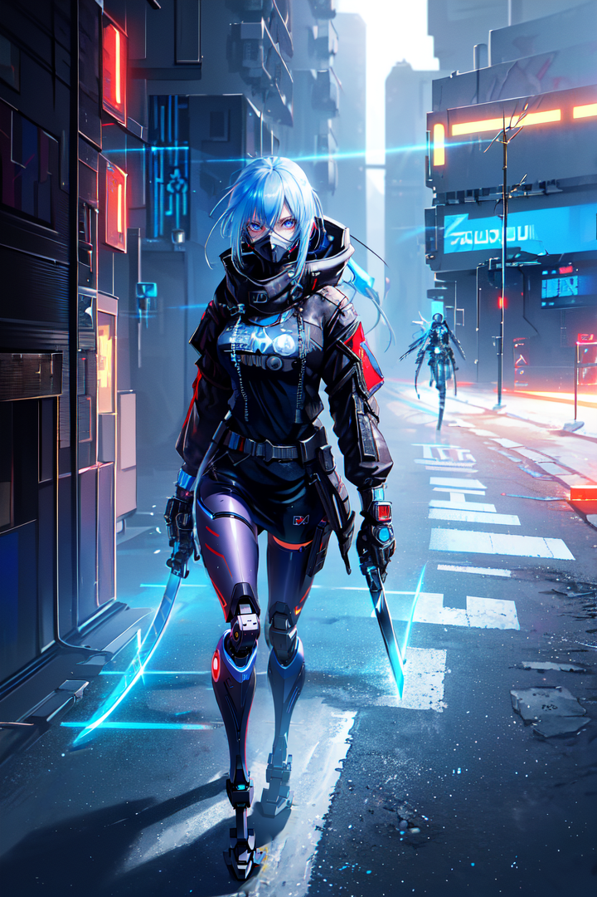

# elifdidemerguven.github.io
elifdidemerguven.github.io 

### Designer and AI Specialist 
Game Designer and Developer, AI Tools Specialist

### Work Experience 
- Product Intern at Colendi
from July 2022 - Dec 2022 · 6 months
- Intern Game Designer at Mojo Games
from Jan 2023 - July 2023 · 7 months

### Skills
- C1 English
- Native Turkish
- Microsoft Docs, Excel, PowerPoint

- 

  <h1>Stable Diffusion</h1>
  
I specialize in generating high-quality, creative visual content. My expertise lies in fine-tuning this AI-driven tool to produce diverse and complex images that are tailored to specific project needs. My proficiency in this technology enables me to leverage its capabilities for innovative image creation and manipulation.

- DALL-E
- Warpfusion
- DeepSpeech
- ChatGPT
- Adobe Firefly
- Adobe Premier Pro
- Adobe Photoshop
- Unity

### Projects 
* Stable Diffusion Products
  

  

  

  

DALL-E Products

  

* Warpfusion Products
* DeepSpeech Products
* Adobe Firefly Products
* Unity Game Demo
